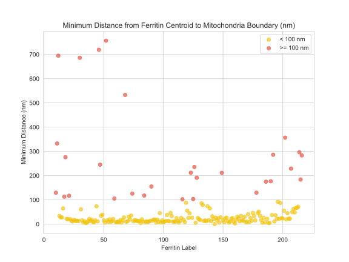

# ferrimitoseg

This repository contains the code specifically targeting segmentation and localization of ferritin-labeled proteins in TEM images, for the paper:

**Genetically Encoded FerriTag as a Specific Label for Cryo-Electron Tomography**  
Chang Wang, Amin Khosrozadeh, Ioan Iacovache, Benoît Zuber

  
  

## Abstract

Cryo-electron tomography (cryoET) combined with subtomogram averaging has revolutionized structural biology by enabling near-atomic resolution imaging of cellular proteins. However, accurately localizing proteins within live cells remains challenging. To address this, we developed a genetically encoded FerriTag labeling strategy using rapamycin-induced oligomerization (FKBP-FRB system) combined with ferritin as a contrast marker for precise protein localization. Our method accurately identifies target proteins in cryoET images, bridging the gap between molecular localization and structural analysis.

## Methodology Overview

Here, we present a Fiji macro for ferritin segmentation and Python for subsequent quantitative analysis:

### Ferritin segmentation in Fiji:
- Gaussian filtering and intensity normalization using CLIJ2
- Intensity transformations and intermode threshold binarization
- Morphological refinement (erosion/dilation)

### Quantitative analysis in Python:
- Localization analysis

## Requirements

- Fiji/ImageJ with CLIJ2 (GPU-accelerated plugin)
- Python 3.8+
- scikit-image
- NumPy

## Citation

If you use this code or approach in your research, please cite our paper:

Wang, C., Khosrozadeh, A., Iacovache, I. & Zuber, B. (2024). *Genetically Encoded FerriTag as a Specific Label for Cryo-Electron Tomography*. bioRxiv, [https://doi.org/10.1101/2024.09.10.612178](https://doi.org/10.1101/2024.09.10.612178)

## Additional References

- **Fiji/ImageJ:** Schindelin et al. (2012). *Fiji: an open-source platform for biological-image analysis.* Nature Methods, 9(7), 676–682.
- **CLIJ:** Haase et al. (2020). *CLIJ: GPU-accelerated image processing for everyone.* Nat Methods, 17, 5–6.
- **scikit-image:** van der Walt et al. (2014). *PeerJ,* 2:e453.

For detailed method implementations and inquiries, please refer to our publication or contact the corresponding author.
